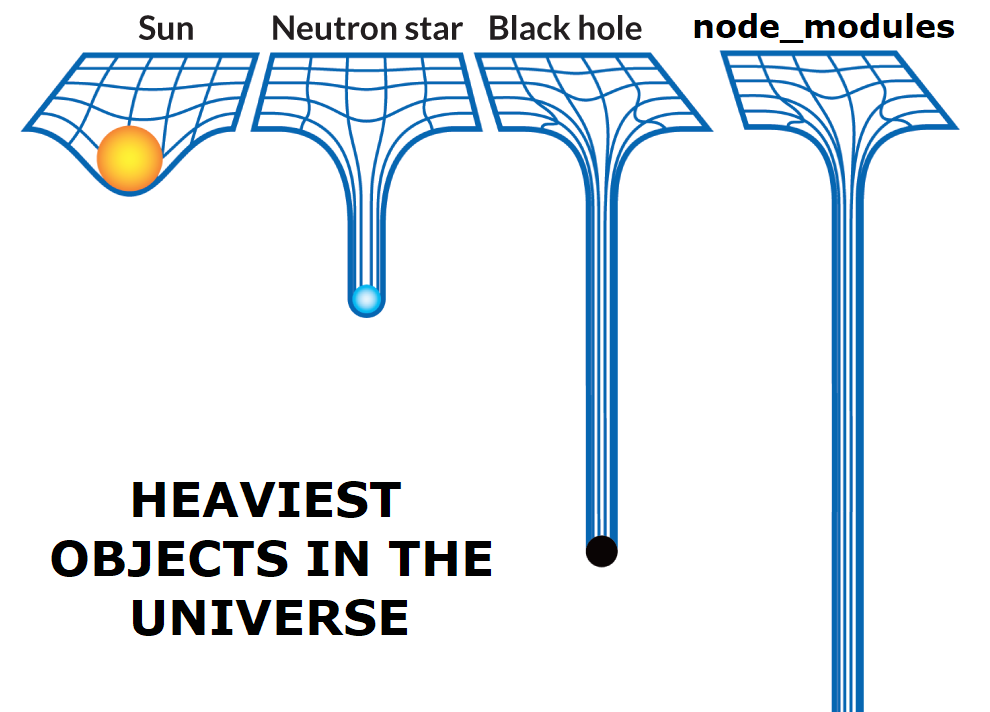

<!-- _class: lead -->

# Node.js Crashcourse
## Web Anwendungen 2
## Sven Eppler


---

<!-- _class: chapter -->

# Node.js
## JavaScript escaped from the browser

---

# Was ist Node.js?

- „Standalone“ Version von JavaScript
- Erschienen im Mai 2009
- Basiert auf Googles V8 JS-Engine (Juli 2008)
- Projektseite: https://nodejs.org/en/

---

# Warum Node.js?

- „Write once, run anywhere“
- Cross-Plattform: Linux, Mac, Windows
- Non-Blocking I/O (Async I/O)
- Selbe Sprache im Frontend/Backend

---

# Node.js installieren

- Projektseite: https://nodejs.org/en/
- Wahlweise die LTS (LongTermSupport)-Version oder die latest-Version
- Nach der Installation steht das Kommando `node` auf der Konsole zur Verfügung
- Node.js liefert keine GUI, nur ein CLI!
- Ohne Startparameter geht Node.js in den REPL-Modus (Read–eval–print loop) wie Python
- Linux/Mac/WSL2: NVM (Node Version Manager)
  - https://github.com/nvm-sh/nvm

---

# Node.js Anwendung starten

- Node.js-Anwendungen haben typischerweise eine `index.js` oder `app.js` Datei als Entry Point
- Diese kann direkt mit `node` ausgeführt werden
- Siehe: `Beispiele/Node.js/HelloWorld/app.js`

```javascript
// app.js
console.log("Hello World!");
```

```bash
$ node app.js
Hello World!
```

---

# Node.js Module

- Node.js ist stark modularisiert und hat ein großes Ökosystem an Modulen
- Zur Verwaltung von Modulen gibt es den Node Package Manager `npm`
- Module werden auf npmjs.com bereitgestellt
- Open Source: Jeder kann seine Module dort veröffentlichen

---

# Verwendung von npm

- Alle notwendigen Module eines Projektes installieren:

```bash
npm install
```

- Ein Modul zum Projekt hinzufügen:

```bash
npm install <ModulName>
```

- Ein Modul deinstallieren:

```bash
npm uninstall <ModulName>
```

---

# package.json

Mit der Datei `package.json` definiert man im Kontext von Node.js ein Projekt. Darin enthalten ist:

- Wie ein Projekt/Modul heißt
- Welche Version es hat
- Metadaten zum Projekt (Autor, Beschreibung)
- Welche Abhängigkeiten zu anderen Modulen es gibt
- Scripts zum Starten/Testen/etc.

---

# package.json

Für eigene Projekte kann man mit `npm init` eine `package.json` generieren.

Mit `npm install` installiert man alle notwendigen Abhängigkeiten aus der `package.json`.

Details: https://docs.npmjs.com/files/package.json

---

# package-lock.json

- Speichert nach einem Lauf von `npm install` alle installierten Module in ihrer konkreten Version
- Problem: Module können Abhängigkeiten „lax“ definieren
  - ModulA benötigt v2.0 oder größer von ModulB
- Solange nur eine v2.0 von ModulB veröffentlicht ist, wird auch immer diese installiert
- Sobald z.B. v2.1 veröffentlicht wird, würde ein Aufruf von `npm install` die v2.1 installieren
- Dadurch installiert das selbe Kommando unter Umständen zu unterschiedlichen Zeiten unterschiedliche Versionen
- Ziel: Konsistente Laufzeitumgebung

---

# node_modules Ordner



---

# node_modules Ordner

- `npm install` speichert alle heruntergeladenen Module im Ordner `node_modules`
- Dadurch kann auch „offline“ entwickelt werden
- Der Inhalt des Ordners wird komplett von NPM verwaltet
- Manuelle Änderungen sollten hier nicht stattfinden
- Der Ordner sollte NICHT in die Versionsverwaltung eingecheckt werden

---

# package.json Scripts

In der Datei `package.json` kann man im Scripts-Abschnitt kleine Scripts ablegen.

Diese Scripts kann man mit `npm run <ScriptName>` ausführen.

```json
{
  "name": "dependenciesexample",
  "scripts": {
    "test": "echo \"Error: no test specified\" && exit 1",
    "my-script": "echo Output of my-script"
  }
}
```

---

# Minimales Express Beispiel

- Express ist das de facto Standard-Framework für Node.js
- Beispiel: `Beispiele/Node.js/MinimalExpress`
    1. Projekt mit `npm install` startklar machen
    1. Anwendung mit `npm start` starten
    1. Browser auf `localhost:3000`

---

<!-- _class: chapter -->

# Ende
## Noch Fragen?
