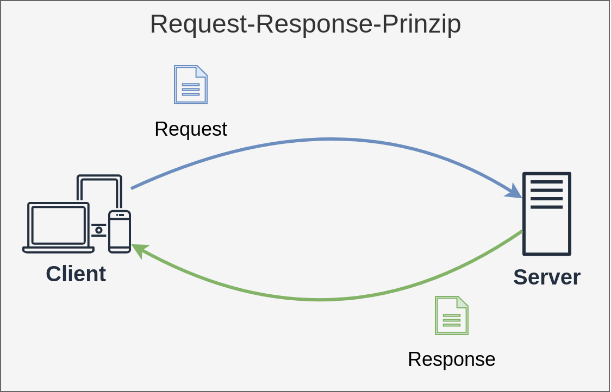
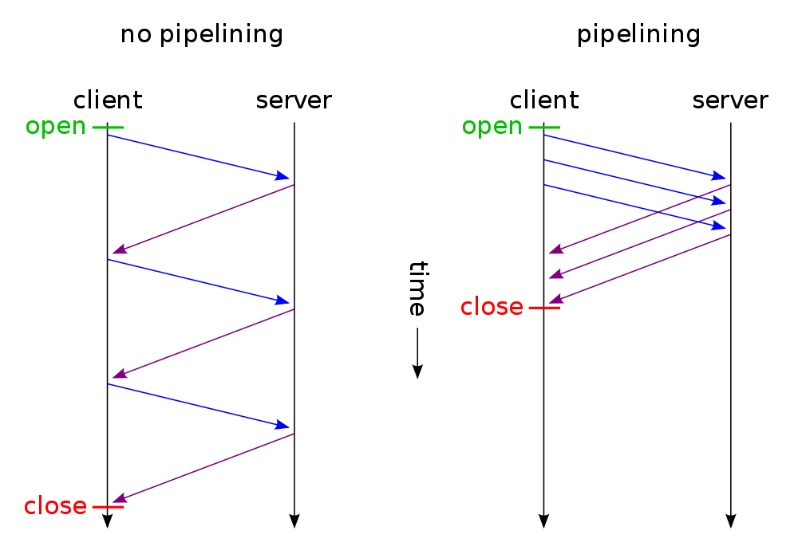

<!-- _class: lead -->

# HTTP 1.1 / 2 / 3
## Web Anwendungen
## Sven Eppler


---

<!-- _class: chapter -->

# Client-Server / Request-Response
## Basic mechanics of HTTP

---

# Client-Server Architektur


- Server: Stellt Dienst bereit
- Client: Konsumiert Dienst
- Client baut Verbindung auf
- Prinzipbedingt zentralisiert
- Server ist "passiv"
- Client ist "aktiv"
- Beispiele: HTTP, FTP, IRC, SMTP, SSH

---

# Request-Response Prinzip



- Ein Client stellt eine Anfrage (Request)
- Der Server antwortet auf diese Anfrage (Response)

---
<!-- _class: lead -->

# HTTP Basics

---

# HTTP Basics

- HyperText Transport Protocol
- 1989, Tim Berners-Lee am CERN
- Basiert auf TCP/IP
- OSI-Schichtenmodell Schicht 7
- Anwendungsschicht
- Plain-Text Protokoll
- HTTP ist stateless (zustandslos)
- Client-Server / Request-Response Konzept

---

# HTTP Basics
- HTTP ist Zeilenbasiert
  Zeilenendezeichen: `CRLF`, `0x0D 0x0A`, `\r\n`
- HTTP Message besteht aus:
    - `Request-Line | Status-Line`
      Unterscheided zwischen Request/Response
    - HTTP Headers (Kopfzeilen, MetaDaten)
    - HTTP Body (Körper, Inhale)
- [RFC2616: Message Format](https://www.rfc-editor.org/info/rfc2616/#section-4)

---

# Request-Line & Status-Line

- Request Line BNF Gramatik:
    - Request-Line = <span style="color: red;">Method</span> SP <span style="color: blue">RequestURI</span> SP <span style="color: green">HTTPVersion</span> CRLF

    Beispiel:
    <span style="color: red;">GET</span> <span style="color: blue">/</span> <span style="color: green">HTTP/1.1</span>&lt;CRLF&gt;
- Status Line BNF Gramatik:
    - Status-Line = <span style="color: green;">HTTPVersion</span> SP <span style="color: red">StatusCode</span> SP <span style="color: blue">ReasonPhrase</span> CRLF

    Beispiel:
    <span style="color: green;">HTTP/1.1</span> <span style="color: red">200</span> <span style="color: blue">OK</span> CRLF

---

# HTTP Request Methods

- GET
    - Abrufen einer Resource
- POST
    - Erzeugt eine Resource auf dem Server
- PUT
    - Erzeugt oder ersetzt eine Resource auf dem Server
- DELETE
    - Löscht eine Resource
- PATCH
    - Ändert eine Resource

---

# HTTP Request Methods

- HEAD
    - Ruft Metadaten für eine Resource ab
- TRACE
    - Spiegelt die Anfrage an den Client
- OPTIONS
    - Welche Methoden sind für die Resource erlaubt
- CONNECT
    - Der Proxy-Server soll zum Ziel durchstellen

---

# HTTP Response Status Codes
<div class="col-2">

- 1XX - Informationen
    - 100 Continue
    - 101 Switching Procotols
- 2XX - Erfolg
    - 200 OK
    - 201 No Content
- 3XX - Umleitung
    - 301 Moved Permanently
    - 307 Temporary Redirect
- 4XX - Client Fehler
    - 400 Bad Request
    - 404 Not Found
- 5XX - Server Fehler
    - 500 Internal Server Error
    - 503 Bad Gatway
- 9XX - Proprietäre Fehler
    - 902 Selbst ausgedacht :smile:

</div>

---

# HTTP Header

- Der Header folgt auf die `Request-Line | Status-Line`
- Er besteht aus Schlüssel-Wert Paaren, die Zeilenweise getrennt werden:
    `Header-Name: Header-Value<CRLF>`
- Header dürfen mehrfach vorkommen
- Reihenfolge nicht vorgegeben
- Es gibt spezille Request- und Response-Header aber auch Header die in beiden Fällen verwendet werden
- Das Ende der Header wird durch einen abschließende Zeilenumbruch markiert (`CRLF`)

---

# HTTP Header

Auszugsweise HTTP-Response-Headers von google.com:

```http
HTTP/1.1 200 OK
Content-Type: text/html; charset=ISO-8859-1
Date: Thu, 08 Oct 2026 13:59:42 GMT
Server: gws
X-XSS-Protection: 0
X-Frame-Options: SAMEORIGIN
Expires: Thu, 08 Oct 2026 13:59:42 GMT
```

---

# HTTP Header

Wichtige Header:
    - `Content-Type`: Was ist der Body? (text/plain, text/html, video/mp4, etc.)
    - `Content-Length`: Wie lang ist der Body?
    - `Host`: Für welche Domain wurde die Anfrage gestellt?
    - `Last-Modified`: Wann wurden die Daten zuletzt geändert?
    - `Set-Cookie`: Setzt ein Cookie auf dem Client
    - `Cookie`: Schickt ein Cookie vom Client zum Server

---

# HTTP Body

- Der Body folgt auf den Header
- Nicht jeder Request/jede Response hat einen Body:
    - GET Request (Fragt Daten an)
    - 404 Not Found Response (Angefragte Daten wurden nicht gefunden)
- Transportiert die Nutzdaten (Payload)
    - Request: Formulardaten, Uploads (z.B.Bilder), JSON-Daten, etc.
    - Response: Html-Seiten, JPEG-Bild, JSON-Daten, etc.
- Wichtig: `Content-Length` Header und tatsächlieh lännge des Bodies _sollten_ übereinstimmen.

---

# HTTP Request Beispiele

Request ohne Body:
```http
GET / HTTP/1.1 <CRLF>
Host: hs-albsig.de <CRLF>
<CRLF>
```

Request mit Body:
```http
POST / HTTP/1.1 <CRLF>
Host: localhost:3000 <CRLF>
Content-Type: application/json <CRLF>
Content-Length: 18 <CRLF>
<CRLF>
{ "some": "JSON" }
```

---
# HTTP Response Beispiele
Response mit Body:
```http
HTTP/1.1 200 OK <CRLF>
Content-Length: 11 <CRLF>
Content-Type: text/plain <CRLF>
<CRLF>
Hallo Welt!
```

Response ohne Body:
```http
HTTP/1.1 301 Moved Permanently <CRLF>
Location: https://www.google.com/ <CRLF>
Date: Thu, 08 Oct 2026 14:28:50 GMT <CRLF>
Expires: Sat, 07 Nov 2026 14:28:50 GMT <CRLF>
<CRLF>
```

---

<!-- _class: image-only -->
# Sprechen Sie HTTP?


---

<!-- _class: lead -->

# HTTP 1 / 1.1 / 2 / 3
## Ein kurzer Rückblick

---

# HTTP 1 / 1.1

- HTTP 1.0: Jeder HTTP-Request wird als TCP/IP-Verbindung abgebildet
    - Hoher TCP/IP Overhead wg. Slow-Start-Algorithmus
    - Server schließt die Verbindung nach jeder Response
        - Daher ist `Content-Length` historisch so "unwichtig"

- HTTP 1.1
    - Connection-Keep-Alive wird eingeführt
        - Eine TCP/IP Connection kann viele Request-Response-Zyklen abbilden
        - `Content-Length` wird plötzlich wichtig
    - Piplining wird eingeführt
        - Verbessert Request-Performance

---

<!-- _class: image-only -->
# HTTP 1.1 Pipelining



---

# HTTP 2

- Connection-Multiplexing (Streams)
    - Eine TCP/IP-Connection kann parallel für mehrere Request-Response-Zyklen genutzt werden
- Bessere Komprimierbarket (insbesondere Header dank HPACK)
- Binärprotokoll
- Server-Push (sowieso benötigte Resourcen können gleich mitgeschickt werden)
- TLS-Only (laut Standard optional, durch Google und Mozilla aber quasi erzwungen)

---

# HTTP 3

- Wechsel von TCP/IP auf UDP
    - Paketververlust blockiert nicht mehr gesamte Connection
- Wechsel von TLS zu Datagram TLS (dTLS)
- Verbindungskontinuität
    - Netzwerkwechsel zerstören bestehende Verbindungen nicht mehr (vgl. Smartphone und Funkturm)
- Schnellerer dTLS Handshake
    - Wiederaufnahme der verschlüsselten Verbindung ohne neuen Handshake
- Verbesserte Header-Komprimierung (QPACK)

---
# HTTP Versions Verteilung


[https://blog.cloudflare.com/de-de/radar-2025-year-in-review/](https://blog.cloudflare.com/de-de/radar-2025-year-in-review/)

---

# Stateless vs. Statefull

- Für Menschen ist so gut wie alles "zustandsbehaftet"
    - Fragt man eine Person zweimal hintereinander nach ihrem Namen, ist diese Person irritiert
    - Menschen merken sich den Zustand "Der weiß doch, wie ich heiße" und reagieren entsprechend bei der 2. Frage anders

- HTTP dagegen ist "zustandslos"
    - Fragt man einen WebServer mehrfach das gleiche, Antwortet er jedes mal so, als wäre es das erste und einzige mal
    - HTTP (und damit auch WebServer) merken sich keinen Zustand!

---

# HTTP is stateless
- Da HTTP inhärent zustandslos ist stellt sich aber eine Frage:
    - Wie "merkt" sich eine WebSite etwas? 
        - Eingeloggt bleiben?
        - Alle Bilder eines Users anzeigen?
        - Benutzer-Tracking zu Werbezwecken?

    - D.H. für jeden Request müssen alle Informationen an den Server transportiert werden
        - Wer ist dieser User?
        - Welches Produkt soll in den Warenkorb?

---

# HTTP Cookies

- Um die immer gleiche Information immer wieder zum Server zu schicken, nutzt HTTP sog. Cookies
    - Das sind Daten die der Server an den Client übergibt (`Set-Cookie`-Header)
    - Der Client speichert diese Daten lokal
    - Bei jedem Request zum selben Server schickt der Browser automatisch die Cookies mit (`Cookie`-Header)

- So kann clientseitig z.B. eine UserId, SessionId, TrackingId, etc. abgelegt werden
- Und serverseitig können die eigentlich "zustandslosen" HTTP-Requests mithilfe dieser Information dann zu einem Zustand zusammengefasst werden.

---
# HTTP Cookies

- Cookies dürfen max. 4kb groß sein
- Cookies sind an die `Host:Port`-Kombination gebunden
    - Cookie von `google.com:80` wird nur an `google.com:80` geschickt
    - Cookie von `google.com:80` wird **nicht** an `amazon.com:80` geschickt
    - Cookie von `google.com:1234` wird **nicht** an `google.com:80` geschickt
- Cookies können sich zusätzlich auf einen Pfad (Path based cookies) beziehen
    - Cookie von `google.com:80/path`wird nur an `google.com:80/path` geschickt
    - Cookie von `google.com:80/path` wird **nicht** an `google.com:80/other` geschickt

---

# HTTP Cookies

- Cookies können ein Ablaufdatum haben
    - vgl. Autologout nach 5 Minuten
- Cookies liegen "ungeschützt" beim Client!
    - Können beliebig beim Client verändert werden
    - Können bequem über die Developer-Console eingesehen/verändert werden
    - Können potentiell auch über JavaScript ausgelesen/verändert/gestohlen werden
    - Für "sichere" Cookies siehe Vorlesung "Authentication"

---

# HTTP Debugging

Web Anwendungen sind **verteilte Anwendungen**, Fehler können im Client, im Server und auf Transportebene passieren.

- Browser Cache abschalten!
- Developer Console nutzen (Network-Tab, JavaScript-Console)
- Server Logs prüfen
- `curl` (kein caching, debug ausgaben, schnell wiederholbar, etc.)
- Postman (kostenpflichtig, Educational Plan)
- Insomia
- hopscotch.io
- Telnet / Wireshark
